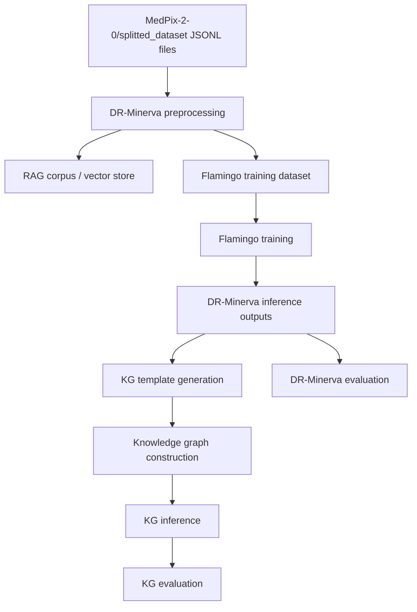

# MedPix Agentic XAI Pipeline Comprehension

This document explains how the repository is organized, how data moves through the two main pipelines, and how to integrate the pieces into a working workflow.

## 1. Project Overview

This workspace contains two related code paths:

- `code-DRMinerva/` builds and evaluates the multimodal DR-Minerva pipeline.
- `code-KG/` builds and evaluates a knowledge-graph pipeline that consumes DR-Minerva outputs.

The dataset lives under `MedPix-2-0/`, which provides:

- image files in `MedPix-2-0/images/`
- split JSONL datasets in `MedPix-2-0/splitted_dataset/`
- case/topic metadata files such as `Case_topic.json` and `Descriptions.json`
- experiment outputs written into `MedPix-2-0/experiments/` and `MedPix-2-0/KG/experiments/`

## 2. High-Level Data Flow

A simpler view is:

- The dataset is loaded from `MedPix-2-0/splitted_dataset/`.
- DR-Minerva uses the data to build RAG memory, train a multimodal model, and produce answer files.
- The KG pipeline reads DR-Minerva outputs and metadata, builds a graph, then answers queries with graph retrieval.
- Evaluation scripts score the text outputs against the expected labels or targets.

## 3. DR-Minerva Pipeline

### 3.1 What each script does

- `RAG_costruction_history.py` builds a history-based corpus and saves a FAISS vector store for retrieval.
- `finetune-minerva.py` fine-tunes the Minerva language model with LoRA adapters.
- `merge_weights.py` merges the LoRA adapters into a standalone model checkpoint.
- `gen_dataset_ft_flamingo.py` prepares the multimodal training set for Flamingo-style training.
- `train.py` trains the Flamingo multimodal model.
- `eval.py` runs inference using zero-shot, static context, or RAG context.
- `evaluate-code.py` computes exact-match style accuracy from the inference result file.
- `inference_rag_gen.py` generates retrieval context used by the RAG branch.

### 3.2 DR-Minerva data flow

1. `load_complete_dataset()` and `load_complete_dataset_description()` read the split JSONL files from `MedPix-2-0/splitted_dataset/`.
2. `RAG_costruction_history.py` groups patient history by `U_id`, writes one text document per case, and builds `MedPix-2-0/MedPix/vectorstore-history-linq-embed-mistral`.
3. `finetune-minerva.py` loads the base Minerva model and fine-tunes LoRA adapters using text instruction data.
4. `merge_weights.py` combines the base model and adapters into a single saved model directory.
5. `inference_rag_gen.py` loads the trained multimodal model and the retrieved histories, then generates prediction files such as `MedPix-2-0/experiments/<n_exp>/results-<split>-<label>.txt`.
6. `evaluate-code.py` reads those result files and computes accuracy.

### 3.3 Output locations

- RAG artifacts: `MedPix-2-0/rag-corpus-history/` and `MedPix-2-0/MedPix/vectorstore-history-linq-embed-mistral/`
- Fine-tuned adapters: `dr_minerva_adapters/`
- Merged model: `dr_minerva/`
- Flamingo training data: `MedPix-2-0/data_ft_flamingo/`
- Inference outputs: `MedPix-2-0/experiments/<n_exp>/`

### 3.4 Practical run order

Use this order when you want the full DR-Minerva workflow:

1. Build the RAG corpus with `RAG_costruction_history.py`.
2. Fine-tune Minerva with `finetune-minerva.py`.
3. Merge the adapters with `merge_weights.py`.
4. Generate Flamingo training data with `gen_dataset_ft_flamingo.py`.
5. Train Flamingo with `train.py`.
6. Run inference with `eval.py` or `inference_rag_gen.py`.
7. Score the outputs with `evaluate-code.py`.

## 4. Knowledge Graph Pipeline

### 4.1 What each script does

- `gen_template_kg.py` creates template text from the dataset, one row per case description.
- `gen_kg.py` turns those templates into a knowledge graph using LlamaIndex and persists the graph store.
- `gen-questions.py` creates question-answer pairs by combining DR-Minerva outputs with case metadata.
- `inference-KG.py` loads the graph and generates KG-based answers.
- `evaluate-csv.py` scores KG predictions using the saved result file.

### 4.2 KG data flow

1. `gen_template_kg.py` reads the split dataset and writes `MedPix-2-0/KG/templates/template-<split>.csv`.
2. `gen_kg.py` reads that CSV, converts rows to `Document` objects, and persists the graph under `MedPix-2-0/KG/graphs/...`.
3. `inference-KG.py` loads the saved graph, reads prior DR-Minerva results from `MedPix-2-0/experiments/4/results-<split>-joint.txt`, and writes KG answers to `MedPix-2-0/KG/experiments/<n_exp>-no-inst/`.
4. `evaluate-csv.py` parses the KG results and writes summary metrics.

### 4.3 Output locations

- Templates: `MedPix-2-0/KG/templates/`
- Persisted graphs: `MedPix-2-0/KG/graphs/`
- Visualizations: `MedPix-2-0/KG/graphs-*.html`, `*.png`, `*.pickle`
- KG experiment outputs: `MedPix-2-0/KG/experiments/`

### 4.4 Practical run order

Use this order for the KG workflow:

1. Generate templates with `gen_template_kg.py`.
2. Build the graph with `gen_kg.py`.
3. Ensure the DR-Minerva result file exists.
4. Run `inference-KG.py`.
5. Evaluate with `evaluate-csv.py`.

## 5. How To Integrate The Pipelines

The cleanest integration is to treat DR-Minerva as the upstream generator and KG as a downstream reasoning layer.

### Integration points

- DR-Minerva produces a result file in `MedPix-2-0/experiments/4/results-<split>-joint.txt`.
- The KG scripts read that file to recover the DR-Minerva output associated with each sample.
- `gen-questions.py` can be used to materialize a QA dataset derived from those predictions.
- `inference-KG.py` uses those outputs together with the graph store to generate graph-grounded answers.

### Recommended integration order

1. Finish or emulate DR-Minerva inference.
2. Generate or verify the expected `results-<split>-joint.txt` file format.
3. Build the KG templates from the same MedPix split.
4. Build the KG graph from those templates.
5. Run KG inference using the DR-Minerva output file as input.
6. Evaluate both branches separately, then compare outputs.

### What must be aligned

- `U_id` must match across all intermediate artifacts.
- The dataset split names must match between DR-Minerva and KG runs.
- The result file format from DR-Minerva must remain compatible with `inference-KG.py` and `evaluate-csv.py`.
- Local model paths such as `LLM/llama31inst/` and `MedPix-2-0/...` must exist or be updated.

## 6. Testing Strategy

### Safe smoke tests

Start with the cheapest checks that do not require model training:

- Run `gen_template_kg.py --inference_split dev` and confirm the CSV is created.
- Inspect a few rows in the generated template file.
- Run `evaluate-code.py` or `evaluate-csv.py` only after you have a known-good result file.
- Confirm the dataset loaders can read the JSONL files under `MedPix-2-0/splitted_dataset/`.

### Higher-cost checks

After the smoke tests pass:

- Run `gen_kg.py --split dev --relations 1 --lower` to build a small graph.
- Run `inference_rag_gen.py` or `eval.py` with a small `n_exp`.
- Only then run full training jobs.

### Known issue to fix before full KG inference

`code-KG/inference-KG.py` currently has a bad call to `get_block(sample, 6)` that does not match the helper signature and will fail at runtime. Fix that before relying on the KG pipeline.

## 7. Integration Checklist

- Verify the MedPix split files exist under `MedPix-2-0/splitted_dataset/`.
- Verify image paths in `MedPix-2-0/images/` are available.
- Verify the DR-Minerva result file exists before KG inference.
- Verify local model checkpoints or Hugging Face model access for Minerva, OpenFlamingo, and the Llama KG model.
- Verify output directories can be created by the scripts.
- Fix the KG inference bug before attempting an end-to-end run.

## 8. Short Summary

The repository has one upstream multimodal pipeline and one downstream graph pipeline. DR-Minerva builds the model outputs, and the KG code reuses those outputs to construct graph-grounded answers. The safest integration path is to validate data loading and template generation first, then graph construction, and only then move into model-heavy training or inference.
